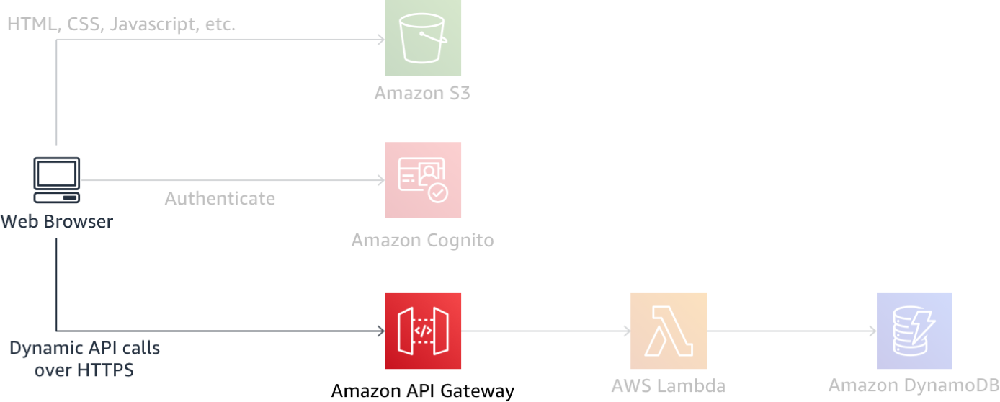
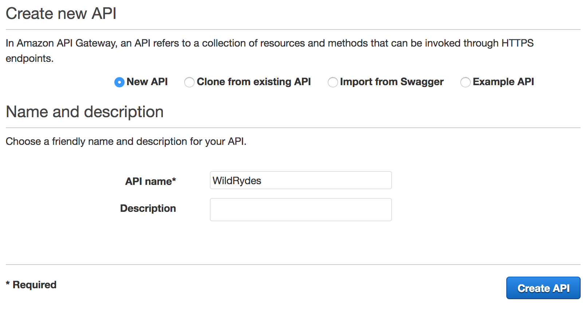
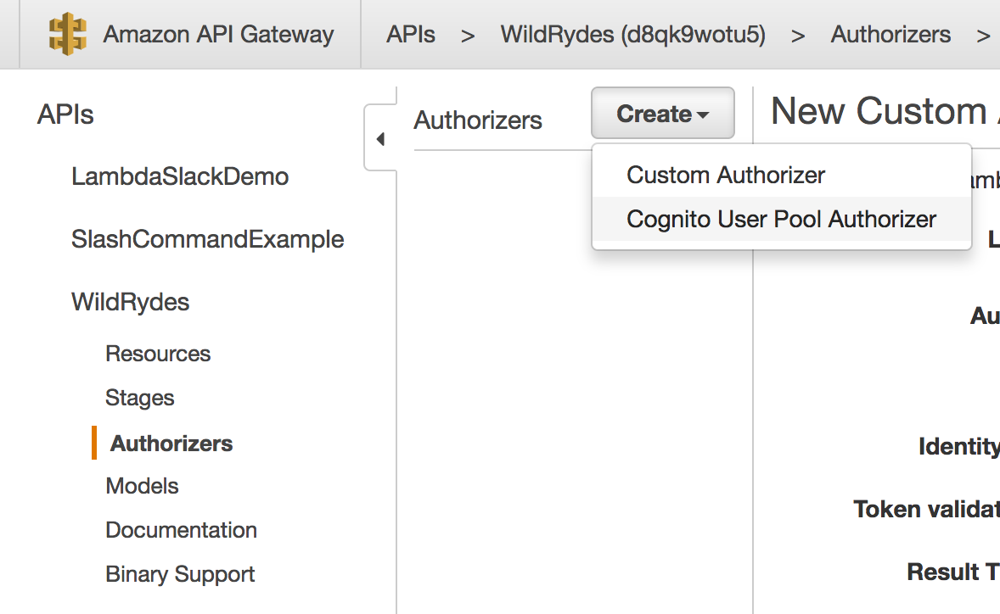
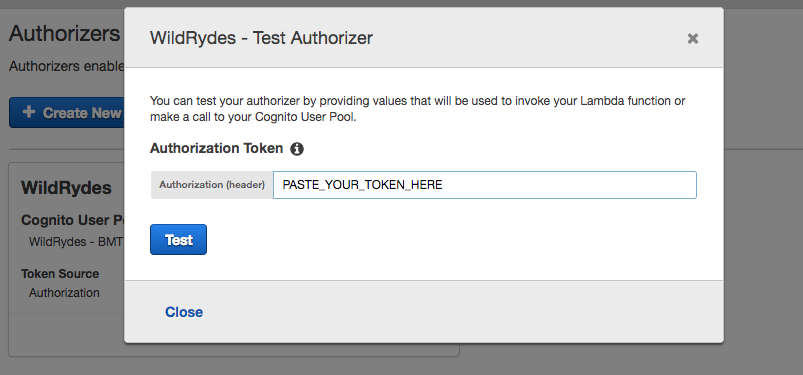
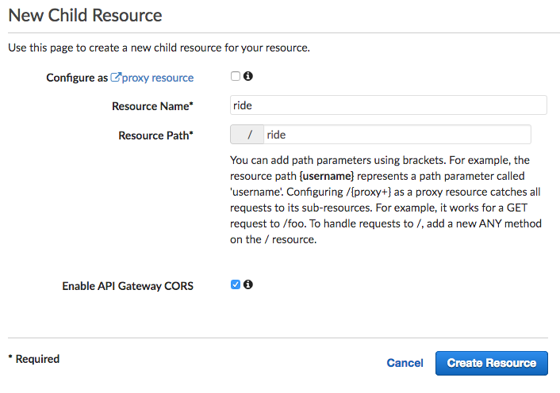
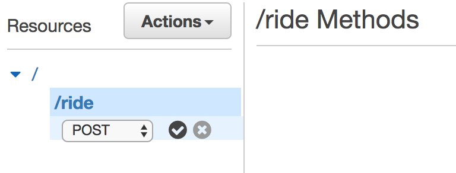
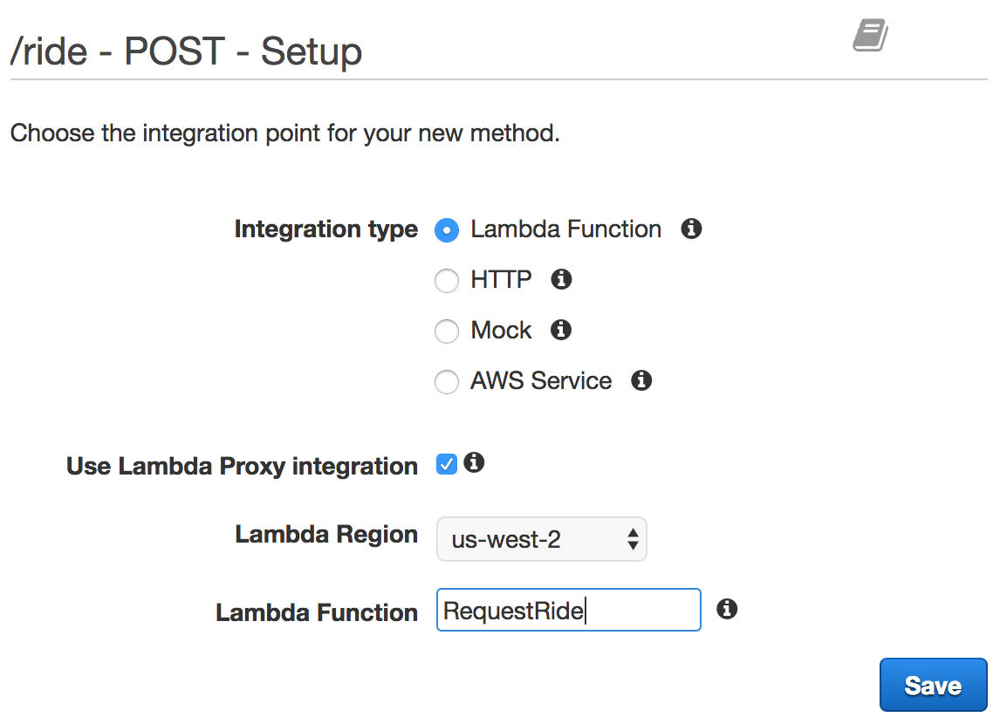
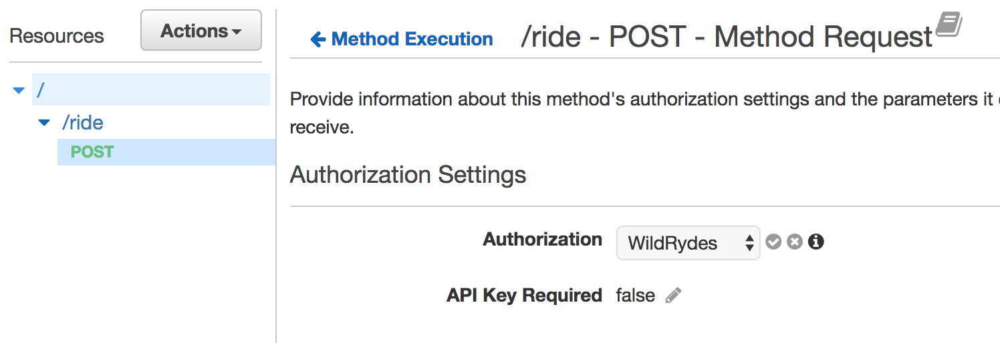

# Module 4: RESTful APIs with AWS Lambda and Amazon API Gateway

In this module you'll use API Gateway to expose the Lambda function you built in the previous module as a RESTful API. This API will be accessible on the public Internet. It will be secured using the Amazon Cognito user pool you created in the previous module. Using this configuration you will then turn your statically hosted website into a dynamic web application by adding client-side JavaScript that makes AJAX calls to the exposed APIs.



The diagram above shows how the API Gateway component you will build in this module integrates with the existing components you built previously. The grayed out items are pieces you have already implemented in previous steps.

The static website you deployed in the first module already has a page configured to interact with the API you'll build in this module. The page at /ride.html has a simple map-based interface for requesting a unicorn ride. After authenticating using the /signin.html page, your users will be able to select their pickup location by clicking a point on the map and then requesting a ride by choosing the "Request Unicorn" button in the upper right corner.

This module will focus on the steps required to build the cloud components of the API, but if you're interested in how the browser code works that calls this API, you can inspect the [ride.js](../1_StaticWebHosting/website/js/ride.js) file of the website. In this case the application uses jQuery's [ajax()](https://api.jquery.com/jQuery.ajax/) method to make the remote request.

If you want to skip ahead to the next module, you can launch one of these AWS CloudFormation templates in the Region of your choice in order to build the necessary resources automatically.

Region| Launch
------|-----
US East (N. Virginia) | [](https://console.aws.amazon.com/cloudformation/home?region=us-east-1#/stacks/new?stackName=wildrydes-webapp-4&templateURL=https://s3.amazonaws.com/wildrydes-us-east-1/WebApplication/4_RESTfulAPIs/backend-api.yaml)
US East (Ohio) | [](https://console.aws.amazon.com/cloudformation/home?region=us-east-2#/stacks/new?stackName=wildrydes-webapp-4&templateURL=https://s3.amazonaws.com/wildrydes-us-east-2/WebApplication/4_RESTfulAPIs/backend-api.yaml)
US West (Oregon) | [](https://console.aws.amazon.com/cloudformation/home?region=us-west-2#/stacks/new?stackName=wildrydes-webapp-4&templateURL=https://s3.amazonaws.com/wildrydes-us-west-2/WebApplication/4_RESTfulAPIs/backend-api.yaml)
EU (Frankfurt) | [](https://console.aws.amazon.com/cloudformation/home?region=eu-central-1#/stacks/new?stackName=wildrydes-webapp-4&templateURL=https://s3.amazonaws.com/wildrydes-eu-central-1/WebApplication/4_RESTfulAPIs/backend-api.yaml)
EU (Ireland) | [](https://console.aws.amazon.com/cloudformation/home?region=eu-west-1#/stacks/new?stackName=wildrydes-webapp-4&templateURL=https://s3.amazonaws.com/wildrydes-eu-west-1/WebApplication/4_RESTfulAPIs/backend-api.yaml)
EU (London) | [](https://console.aws.amazon.com/cloudformation/home?region=eu-west-2#/stacks/new?stackName=wildrydes-webapp-4&templateURL=https://s3.amazonaws.com/wildrydes-eu-west-2/WebApplication/4_RESTfulAPIs/backend-api.yaml)
Asia Pacific (Tokyo) | [](https://console.aws.amazon.com/cloudformation/home?region=ap-northeast-1#/stacks/new?stackName=wildrydes-webapp-4&templateURL=https://s3.amazonaws.com/wildrydes-ap-northeast-1/WebApplication/4_RESTfulAPIs/backend-api.yaml)
Asia Pacific (Seoul) | [](https://console.aws.amazon.com/cloudformation/home?region=ap-northeast-2#/stacks/new?stackName=wildrydes-webapp-4&templateURL=https://s3.amazonaws.com/wildrydes-ap-northeast-2/WebApplication/4_RESTfulAPIs/backend-api.yaml)
Asia Pacific (Sydney) | [](https://console.aws.amazon.com/cloudformation/home?region=ap-southeast-2#/stacks/new?stackName=wildrydes-webapp-4&templateURL=https://s3.amazonaws.com/wildrydes-ap-southeast-2/WebApplication/4_RESTfulAPIs/backend-api.yaml)
Asia Pacific (Mumbai) | [](https://console.aws.amazon.com/cloudformation/home?region=ap-south-1#/stacks/new?stackName=wildrydes-webapp-4&templateURL=https://s3.amazonaws.com/wildrydes-ap-south-1/WebApplication/4_RESTfulAPIs/backend-api.yaml)

<details>
<summary><strong>CloudFormation Launch Instructions (expand for details)</strong></summary><p>

1. Click the **Launch Stack** link above for the region of your choice.

1. Click **Next** on the Select Template page.

1. Provide the name of your website bucket from module 1 for the  **Website Bucket Name** (e.g. `wildrydes-yourname`) and choose **Next**.

    **Note:** You must specify the same bucket name you used in the previous module. If you provide a bucket name that does not exist or that you do not have write access to, the CloudFormation stack will fail during creation.

1. Provide the ARN for the User Pool we created in module 2. You can find the User Pool ARN in the [Amazon Cognito console](https://console.aws.amazon.com/cognito/users/).

1. On the Options page, leave all the defaults and click **Next**.

1. On the Review page, check the box to acknowledge that CloudFormation will create IAM resources and click **Create**.
    

    This template uses a custom resource to update the `/js/config.js` file with the new API endpoint URL

1. Wait for the `wildrydes-webapp-4` stack to reach a status of `CREATE_COMPLETE`.

1. Verify the Wild Rydes home page is loading properly and try to request a ride.

</p></details>

## Implementation Instructions

Each of the following sections provides an implementation overview and detailed, step-by-step instructions. The overview should provide enough context for you to complete the implementation if you're already familiar with the AWS Management Console or you want to explore the services yourself without following a walkthrough.

If you're using the latest version of the Chrome, Firefox, or Safari web browsers the step-by-step instructions won't be visible until you expand the section.

### 1. Create a New REST API
Use the Amazon API Gateway console to create a new API.

<details>
<summary><strong>Step-by-step instructions (expand for details)</strong></summary><p>

1. In the AWS Management Console, click **Services** then select **API Gateway** under Networking & Content Delivery.

1. Choose **Create API**.

1. Select **New API** and enter `WildRydes` for the **API Name**.

1. Keep `Edge optimized` selected in the **Endpoint Type** dropdown.
    ***Note***: Edge optimized are best for public services being accessed from the Internet. Regional endpoints are typically used for APIs that are accessed primarily from within the same AWS Region.

1. Choose **Create API**

    

</p></details>


### 2. Create a Cognito User Pools Authorizer

#### Background
Amazon API Gateway can use the JWT tokens returned by Cognito User Pools to authenticate API calls. In this step you'll configure an authorizer for your API to use the user pool you created in [module 2](../2_UserManagement).

#### High-Level Instructions
In the Amazon API Gateway console, create a new Cognito user pool authorizer for your API. Configure it with the details of the user pool that you created in the previous module. You can test the configuration in the console by copying and pasting the auth token presented to you after you log in via the /signin.html page of your current website.

<details>
<summary><strong>Step-by-step instructions (expand for details)</strong></summary><p>

1. Under your newly created API, choose **Authorizers**.

1. Chose **Create New Authorizer**.

1. Enter `WildRydes` for the Authorizer name.

1. Select **Cognito** for the type.

1. In the Region drop-down under **Cognito User Pool**, select the Region where you created your Cognito user pool in module 2 (by default the current region should be selected).

1. Enter `WildRydes` (or the name you gave your user pool) in the **Cognito User Pool** input.

1. Enter `Authorization` for the **Token Source**.

1. Choose **Create**.

    

#### Verify your authorizer configuration

1. Open a new browser tab and visit `/ride.html` under your website's domain.

1. If you are redirected to the sign-in page, sign in with the user you created in the last module. You will be redirected back to `/ride.html`.

1. Copy the auth token from the notification on the `/ride.html`,

1. Go back to previous tab where you have just finished creating the Authorizer

1. Click **Test** at the bottom of the card for the authorizer.

1. Paste the auth token into the **Authorization Token** field in the popup dialog.

    

1. Click **Test** button and verify that the response code is 200 and that you see the claims for your user displayed.

</p></details>

### 3. Create a new resource and method
Create a new resource called /ride within your API. Then create a POST method for that resource and configure it to use a Lambda proxy integration backed by the RequestUnicorn function you created in the first step of this module.

<details>
<summary><strong>Step-by-step instructions (expand for details)</strong></summary><p>

1. In the left nav, click on **Resources** under your WildRydes API.

1. From the **Actions** dropdown select **Create Resource**.

1. Enter `ride` as the **Resource Name**.

1. Ensure the **Resource Path** is set to `ride`.

1. Select **Enable API Gateway CORS** for the resource.

1. Click **Create Resource**.

    

1. With the newly created `/ride` resource selected, from the **Action** dropdown select **Create Method**.

1. Select `POST` from the new dropdown that appears, then **click the checkmark**.

    

1. Select **Lambda Function** for the integration type.

1. Check the box for **Use Lambda Proxy integration**.

1. Select the Region you are using for **Lambda Region**.

1. Enter the name of the function you created in the previous module, `RequestUnicorn`, for **Lambda Function**.

1. Choose **Save**. Please note, if you get an error that you function does not exist, check that the region you selected matches the one you used in the previous module.

    

1. When prompted to give Amazon API Gateway permission to invoke your function, choose **OK**.

1. Choose on the **Method Request** card.

1. Choose the pencil icon next to **Authorization**.

1. Select the WildRydes Cognito user pool authorizer from the drop-down list, and click the checkmark icon.

    

</p></details>

### 4. Deploy Your API
From the Amazon API Gateway console, choose Actions, Deploy API. You'll be prompted to create a new stage. You can use prod for the stage name.

<details>
<summary><strong>Step-by-step instructions (expand for details)</strong></summary><p>

1. In the **Actions** drop-down list select **Deploy API**.

1. Select **[New Stage]** in the **Deployment stage** drop-down list.

1. Enter `prod` for the **Stage Name**.

1. Choose **Deploy**.

1. Note the **Invoke URL**. You will use it in the next section.

</p></details>

### 5. Update the Website Config
Update the /js/config.js file in your website deployment to include the invoke URL of the stage you just created. You should copy the invoke URL directly from the top of the stage editor page on the Amazon API Gateway console and paste it into the \_config.api.invokeUrl key of your sites /js/config.js file. Make sure when you update the config file it still contains the updates you made in the previous module for your Cognito user pool.

<details>
<summary><strong>Step-by-step instructions (expand for details)</strong></summary><p>

If you completed module 2 manually, you can edit the `config.js` file you have saved locally. If you used the AWS CloudFormation template, you must first download the `config.js` file from your S3 bucket. To do so, visit `/js/config.js` under the base URL for your website and choose **File**, then choose **Save Page As** from your browser.

1. Open the config.js file in a text editor.

1. Update the **invokeUrl** setting under the **api** key in the config.js file. Set the value to the **Invoke URL** for the deployment stage your created in the previous section.

    An example of a complete `config.js` file is included below. Note, the actual values in your file will be different.

    ```JavaScript
    window._config = {
        cognito: {
            userPoolId: 'us-west-2_uXboG5pAb', // e.g. us-east-2_uXboG5pAb
            userPoolClientId: '25ddkmj4v6hfsfvruhpfi7n4hv', // e.g. 25ddkmj4v6hfsfvruhpfi7n4hv
            region: 'us-west-2' // e.g. us-east-2
        },
        api: {
            invokeUrl: 'https://rc7nyt4tql.execute-api.us-west-2.amazonaws.com/prod' // e.g. https://rc7nyt4tql.execute-api.us-west-2.amazonaws.com/prod,
        }
    };
    ```

1. Save your changes locally.

1. In the AWS Management Console, choose **Services** then select **S3** under Storage.

1. Choose your website bucket and then browse to the `js` key prefix.

1. Choose **Upload**.

1. Choose **Add files**, select the local copy of `config.js` and then click **Next**.

1. Choose **Next** without changing any defaults through the `Set permissions` and `Set properties` sections.

1. Choose **Upload** on the `Review` section.

</p></details>

## Implementation Validation

**Note:** It's possible that you will see a delay between updating the config.js file in your S3 bucket and when the updated content is visible in your browser. You should also ensure that you clear your browser cache before executing the following steps.

1. Visit `/ride.html` under your website domain.

1. If you are redirected to the sign in page, sign in with the user you created in the previous module.

1. After the map has loaded, click anywhere on the map to set a pickup location.

1. Choose **Request Unicorn**. You should see a notification in the right sidebar that a unicorn is on its way and then see a unicorn icon fly to your pickup location.

Congratulations, you have completed the Wild Rydes Web Application Workshop! Check out our [other workshops](../../README.md#workshops) covering additional serverless use cases.

See this workshop's [cleanup guide](../9_CleanUp) for instructions on how to delete the resources you've created.
