# Module 5: Enabling 3rd party applications using OAuth 2.0

In this module we will turn our Wild Rydes application into a platform, enabling third party developers to build new applications on top of our APIs. By leveraging third party developers, it will be easier for us to open new markets and geographies as well as provide new functionality for our riders. 

You'll configure your Cognito User Pool from module #2 to enable OAuth 2.0 flows. Using OAuth, third party developers can build new client applications on top of your APIs. We will create a new method in the application's API that allows unicorns to list the rides they have given. This will open a new line of business for us, making it easy for third party developers to build applications that help unicorns manage their time and earnings. First, we will create the new method to list rides. Then, we will enable OAuth flows in our Cognito User Pool and deploy a sample client. Finally, we will leverage Usage Plans in API Gateway to throttle and meter usage of our APIs by third party developers.

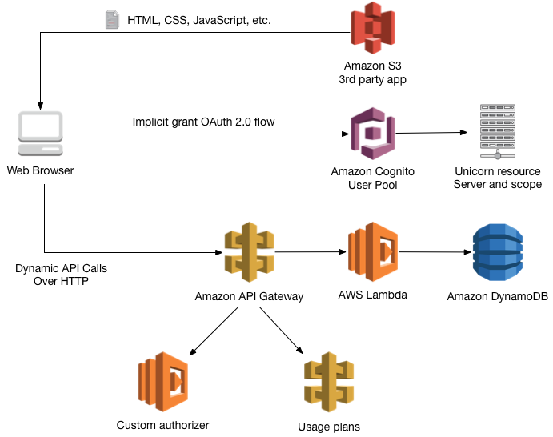

The diagram above shows how the component of the new third party application interact with our current Wild Rydes architecture. The web application is deployed in an S3 bucket. The application uses the Cognito User Pools built-in UI to start an implicity grant OAuth 2.0 flow and authenticate the user. Once the Unicorn user is authenticated the client application receives an identity and access token for the Unicorn. Tokens for Unicorns include an additional `Unicorn` claim that gives them access to the new API. When a client request hits API Gateway, usage plans will make sure that the developers is allowed access and that the application is not exceeding its limits (requests per second and quota). Still in API Gateway, a custom authorizer checks for the `Unicorn` claim in the JWT access token produced by Cognito and passes the unicorn name to the backend Lambda function. The backend Lambda function uses the unicorn name from the access token to query the rides table in DynamoDB.

### Prerequisites
This module depends on all of the previous four modules in the Wild Rydes workshop. To make it easier to get started, we have prepared a CloudFormation template that can launch the complete stack for you.

Region| Launch
------|-----
US East (N. Virginia) | [](https://console.aws.amazon.com/cloudformation/home?region=us-east-1#/stacks/new?stackName=wildrydes-webapp&templateURL=https://s3.amazonaws.com/wildrydes-us-east-1/WebApplication/5_Oauth/prerequisites.yaml)
US East (Ohio) | [](https://console.aws.amazon.com/cloudformation/home?region=us-east-2#/stacks/new?stackName=wildrydes-webapp&templateURL=https://s3.amazonaws.com/wildrydes-us-east-2/WebApplication/5_Oauth/prerequisites.yaml)
US West (Oregon) | [](https://console.aws.amazon.com/cloudformation/home?region=us-west-2#/stacks/new?stackName=wildrydes-webapp&templateURL=https://s3.amazonaws.com/wildrydes-us-west-2/WebApplication/5_Oauth/prerequisites.yaml)
EU (Frankfurt) | [](https://console.aws.amazon.com/cloudformation/home?region=eu-central-1#/stacks/new?stackName=wildrydes-webapp&templateURL=https://s3.amazonaws.com/wildrydes-eu-central-1/WebApplication/5_Oauth/prerequisites.yaml)
EU (Ireland) | [](https://console.aws.amazon.com/cloudformation/home?region=eu-west-1#/stacks/new?stackName=wildrydes-webapp&templateURL=https://s3.amazonaws.com/wildrydes-eu-west-1/WebApplication/5_Oauth/prerequisites.yaml)
EU (London) | [](https://console.aws.amazon.com/cloudformation/home?region=eu-west-2#/stacks/new?stackName=wildrydes-webapp&templateURL=https://s3.amazonaws.com/wildrydes-eu-west-2/WebApplication/5_Oauth/prerequisites.yaml)
Asia Pacific (Tokyo) | [](https://console.aws.amazon.com/cloudformation/home?region=ap-northeast-1#/stacks/new?stackName=wildrydes-webapp&templateURL=https://s3.amazonaws.com/wildrydes-ap-northeast-1/WebApplication/5_Oauth/prerequisites.yaml)
Asia Pacific (Seoul) | [](https://console.aws.amazon.com/cloudformation/home?region=ap-northeast-2#/stacks/new?stackName=wildrydes-webapp&templateURL=https://s3.amazonaws.com/wildrydes-ap-northeast-2/WebApplication/5_Oauth/prerequisites.yaml)
Asia Pacific (Sydney) | [](https://console.aws.amazon.com/cloudformation/home?region=ap-southeast-2#/stacks/new?stackName=wildrydes-webapp&templateURL=https://s3.amazonaws.com/wildrydes-ap-southeast-2/WebApplication/5_Oauth/prerequisites.yaml)
Asia Pacific (Mumbai) | [](https://console.aws.amazon.com/cloudformation/home?region=ap-south-1#/stacks/new?stackName=wildrydes-webapp&templateURL=https://s3.amazonaws.com/wildrydes-ap-south-1/WebApplication/5_Oauth/prerequisites.yaml)

After the stack created successfully, open the **Outputs** tab in the CloudFormation console. Copy the **WebsiteURL** output value and navigate to the page with a browser window.

On the Wild Rydes website, click the **Giddy Up!** button and register a new user. Once you have received your verification code, navigate to the **verify.html** page of the website to submit your code. From the login page, use your new credentials to log into the website. Use the application to request a few unicorn rides, we will need the data later in this module.


### 1. Create the new List Rides Lambda function

#### Background
AWS Lambda runs your code in response to an API request. In this step, you will create a new Lambda functions to answer unicorn requests to the list rides API. In the Wild Rydes application, we have mapped each API method to an independent Lambda function. You also have the option to group multiple API methods in a single Lambda function. To keep writing code with the libraries you are already familiar with, we have created two open source frameworks: [aws-serverless-express](https://github.com/awslabs/aws-serverless-express) and [aws-serverless-java-container](http://github.com/awslabs/aws-serverless-java-container). 

#### High-Level Instructions
Use the AWS Lambda console to create a new Lambda function called **ListUnicornRides** that will process the API requests. Use the provided [listUnicornRides.js](listUnicornRides.js) example implementation for your function code. Just copy and paste from that file into the AWS Lambda console's editor.

Make sure to configure your function to use the `WildRydesLambda` IAM role you created in module 2 of this workshop.

<details>
<summary><strong>Step-by-step instructions (expand for details)</strong></summary><p>

1. Choose on **Services** then select **Lambda** in the Compute section.

1. Choose **Create function**.

1. Click the **Author from scratch** button at the top of the blueprint list.

1. Don't add any triggers at this time. Choose **Next** to proceed to defining your function.

1. Enter **ListUnicornRides** in the **Name** field.

1. Optionally enter a description.

1. Select **Node.js 6.10** for the **Runtime**.

1. Copy and paste the code from [listUnicornRides.js](listUnicornRides.js) into the code entry area.

    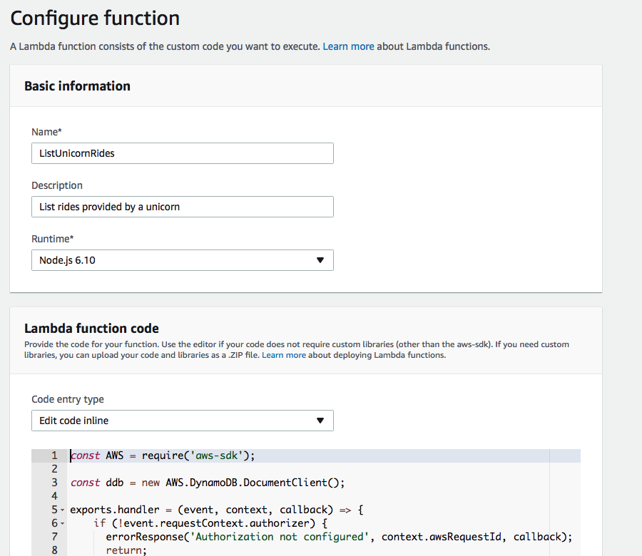

1. Leave the default of **index.handler** for the **Handler** field.

1. Select **WildRydesLambda** from the **Existing Role** dropdown.

	 

1. Choose **Next** and then choose **Create function** on the Review page.

</p></details>

### 2. Create the new custom authorizer Lambda function

#### Background
Amazon API Gateway can leverage an AWS Lambda function to make authorization decisions. In order to support bearer tokens, such as JWT tokens, you can use custom authorizers. When configured with a custom authorizer, API Gateway invokes a Lambda function with the request token and context. The Lambda custom authorizer must return a policy that API Gateway can use to make the authorization decision for the entire API, not just the specific method that was called. To make the creation of custom authorizers easier, we have created JavaScript and Python blueprints that you can select from the Lambda console. These blueprints contain a utility object that simplifies policy generation.

You can alos return a set of key/value pairs that are appended to the request context values. The code for our custom authorizer is in the `ListUnicornAuthorizer` folder, open the folder and take a look at the `index.js` file to get an idea of how our custom authorizer works.

#### High-Level Instructions
Use the AWS Lambda console to create a new Lambda function called **ListUnicornsAuthorizer** that will process incoming JWT bearer tokens. Uploaded the provided [listUnicornAuthorizer.zip](listUnicornAuthorizer.zip) as the function code. The authorizer Lambda function relies on an environment variable called **`USER_POOL_ID`**, define this in the Lambda console and set the value of the WildRydes **Pool Id** from the Cognito console.

Make sure to configure your function to use the **WildRydesLambda** IAM role you created in module 2 of this workshop.

<details>
<summary><strong>Step-by-step instructions (expand for details)</strong></summary><p>

1. Choose on **Services** then select **Lambda** in the Compute section.

1. Choose **Create function**.

1. Click the **Author from scratch** button at the top of the blueprint list.

1. Enter **ListUnicornAuthorizer** in the **Name** field.

1. Select **WildRydesLambda** from the **Existing Role** dropdown.

1. Click **Create function**.

1. Change the **Code entry type** to **Upload a .ZIP file**.

1. Select **Node.js 6.10** for the **Runtime**.

1. Leave the default of **index.handler** for the **Handler** field.

1. Click the **Upload** button and select the [listUnicornAuthorizer.zip](listUnicornAuthorizer.zip) file in the current module folder.

1. Expand the **Environment variables** section and declare a new variable called **USER_POOL_ID**. The value for the variable is the **Pool Id** for the WildRydes user pool, you can find the value in the Cognito console.

    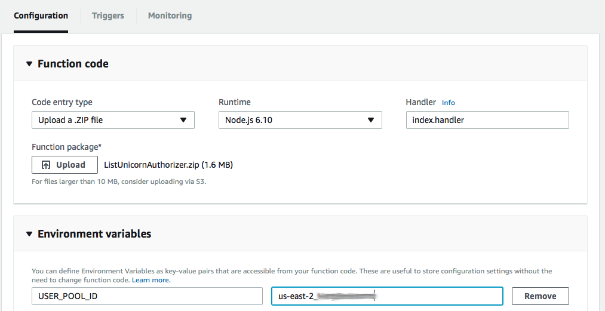


1. Click **Save** at the top of the function page.

</p></details>

### 3. Configure the new custom authorizer

#### Background
Amazon API Gateway can leverage AWS Lambda functions to make authorization decision. This enables you to customize the business logic behind the scenes. API Gateway supports two type of custom authorizers: **Token authorizers** and **Request authorizers**. You can use Token authorizers when your authorization decision is purely based on the client's bearer token. Request authorizers give your Lambda function access to all of the request information except for the body.

#### High-level Instructions
Open the API Gateway console and create a new authorizer in the **WildRydes** API we created in module #4. The auhtorizer should use the **ListUnicornAuthorizer** function we created in the previous step. You should configure the new authorizer as a **Token authorizer** and the token source should be the **Authorization** header.

<details>
<summary><strong>Step-by-step instructions (expand for details)</strong></summary><p>

1. Open the **Services** menu and select **API Gateway** in the Application Services section.

1. Open the **WildRydes** API in the left menu and select the **Authorizers** page.

    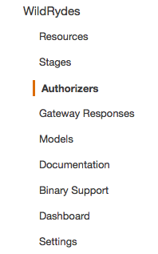

1. Click the button to **Create New Authorizer** at the top of the page.

1. Enter **ListUnicornAuthorizer** as the **Name** and **Lambda** as the **Type**.

1. Using the **Lambda Function** field, select your region and enter the **ListUnicornAuthorizer** Lambda function name.

1. Leave the **Lambda Execution Role** field blank. Configured this way, the API Gateway console automatically sets the permissions on the Lambda function to allow the invocation. The console will ask you to confirm this action as you save the new authorizer settings.

1. Select **Token** as the **Lambda Event Payload** and enter **Authorization** as the **Token Source**.

1. Leave the default values in the **Authorization Caching** settings and click **Create**

    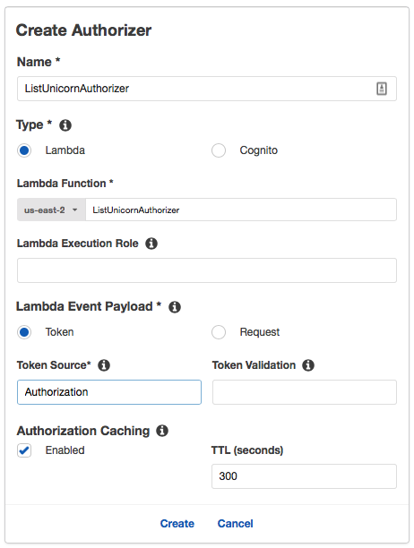

1. The API GAteway console asks you to confirm the new permissions on the Lambda function. Click **Grant & Create**.

</p></details>

### 4. Create the new API Gateway method

#### High-Level Instructions
In the API Gateway console, open the `WildRydes` API we created in module #4 and add a new **GET** method to the `/ride` resource. The method integration should be a **Lambda Proxy** integration to the **ListUnicornRides** function we created in step #1 of this module. Configure the new method to use the **ListUnicornAuthorizer** we created in the previous step for authorization. Once you have made the changes to the API resources, deploy the new configuration to the existing **prod** stage.

<details>
<summary><strong>Step-by-step instructions (expand for details)</strong></summary><p>

1. Open the **Services** menu and select **API Gateway** in the Application Services section.

1. Open the **WildRydes** API and select the `/ride` resource.

1. Using the **Actions** dropdown menu in the **Resources** pane, select **Create Method**.

1. Configure the new method as a **GET** and confirm the settings with the small checkmark button next to the dropdown.

1. In the method integration settings screen, select **Lambda Function** as the **Integration Type**, check the **Use Lambda Proxy Integration** checkbox, then select your Lambda region and use **ListUnicornRides** as the function name.

    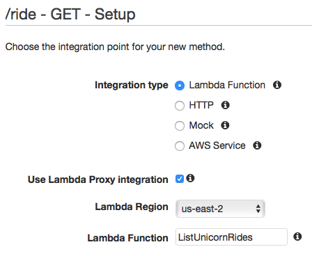

1. Click **Save** and confirm the new permissions on the Lambda function.

1. In the **Method Execution** screen, open the **Method Request** pane.

1. Click on the pencil icon next to the **Authorization** settings to change the value and select the **ListUnicornAuthorizer** from the dropdown.

    

1. Click the checkmark icon next to the dropdown to save your changes.

1. Using the **Actions** dropdown in the **Resources** pane, select **Deploy API**.

1. In the deployment modal window, select the **prod** stage from the **Deployment stage** dropdown and then click **Deploy**.

</p></details>

### 5. Create S3 bucket for static website

#### Background
Our new partner website, called Unicorn Manager, is also a static application hosted on Amazon S3. You can define who can access the content in your S3 buckets using a bucket policy. Bucket policies are JSON documents that specify what principals are allowed to execute various actions against the objects in your bucket. 

By default objects in an S3 bucket are available via URLs with the structure http://<Regional-S3-prefix>.amazonaws.com/<bucket-name>/<object-key>. In order to serve assets from the root URL (e.g. /index.html), you'll need to enable website hosting on the bucket. This will make your objects available at the AWS Region-specific website endpoint of the bucket: <bucket-name>.s3-website-<AWS-region>.amazonaws.com

Because our application will interact with Cognito via an OAuth 2.0 flow, which requires a redirect, we need out website to use HTTPS. To have an HTTPS endpoint for an S3 static website, we can use a [CloudFront distribution](https://aws.amazon.com/cloudfront/).

#### High-Level Instructions
Use the console or AWS CLI to create an Amazon S3 bucket. Keep in mind that your bucket's name must be globally unique across all regions and customers. We recommend using a name like `unicornmanager-firstname-lastname`. If you get an error that your bucket name already exists, try adding additional numbers or characters until you find an unused name.

You will need to add a bucket policy to your new Amazon S3 bucket to let anonymous users view your site. By default your bucket will only be accessible by authenticated users with access to your AWS account. See [this example](http://docs.aws.amazon.com/AmazonS3/latest/dev/example-bucket-policies.html#example-bucket-policies-use-case-2) of a policy that will grant read only access to anonymous users. This example policy allows anyone on the Internet to view your content. The easiest way to update a bucket policy is to use the console. Select the bucket, choose the permission tab and then select Bucket Policy.

Using the console, enable static website hosting. You can do this on the Properties tab after you've selected the bucket. Set `index.html` as the index document, and leave the error document blank. See the documentation on [configuring a bucket for static website hosting](https://docs.aws.amazon.com/AmazonS3/latest/dev/HowDoIWebsiteConfiguration.html) for more details.

Using the CloudFront console, create a new Distribution for web content specifying the S3 static website URL as the origin domain and / as the path. Make sure that the distribution only accepts HTTPS requests.

<details>
<summary><strong>Step-by-step instructions (expand for details)</strong></summary><p>

1. In the AWS Management Console choose **Services** then select **S3** under Storage.

1. Choose **+Create Bucket**

1. Provide a globally unique name for your bucket such as `unicornmanager-firstname-lastname`.

1. Select the Region you've chosen to use for this workshop from the dropdown.

1. Choose **Create** in the lower left of the dialog without selecting a bucket to copy settings from.

    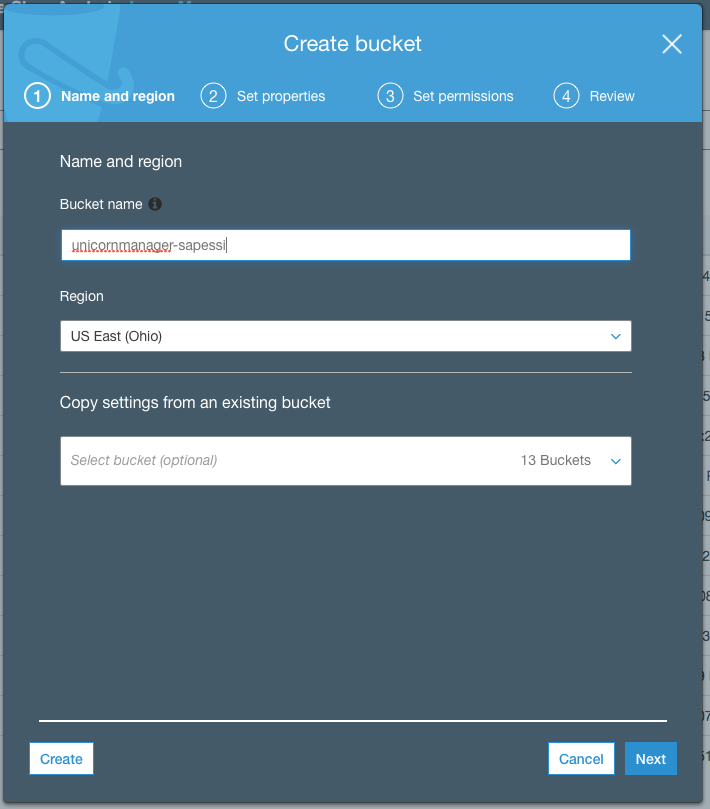

1. Open the bucket you just created.

1. Choose the **Permissions** tab, then choose **Bucket Policy**.

1. Enter the following policy document into the bucket policy editor replacing `[YOUR_BUCKET_NAME]` with the name of the bucket you created in section 1:

    ```json
    {
        "Version": "2012-10-17",
        "Statement": [
            {
                "Effect": "Allow",
                "Principal": "*",
                "Action": "s3:GetObject",
                "Resource": "arn:aws:s3:::[YOUR_BUCKET_NAME]/*"
            }
        ]
    }
    ```

    

1. Choose **Save** to apply the new policy.

1. Next, choose the **Properties** tab.

1. Choose the **Static website hosting** card.

1. Select **Use this bucket to host a website** and enter `index.html` for the Index document. Leave the other fields blank.

1. Note the **Endpoint** URL at the top of the dialog before choosing **Save**. You will use this URL throughout the rest of the workshop to view your web application. From here on this URL will be referred to as your website's base URL.

1. Click **Save** to save your changes.

    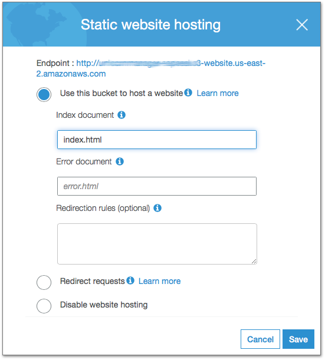

1. Next, open the **CloudFront** console under the **Networking & Content Delivery**.

1. In the **CloudFront Distributions** page, click **Create Distribution**.

1. Select **Web** as the delivery method, click **Get Started**.

1. In the **Origin Domain Name** field, paste the URL for the S3 static website we just created and **/** as the origin path.

1. In the **Viewer Protocol Policy** make sure that **Redirect HTTP to HTTPS** is selected.

    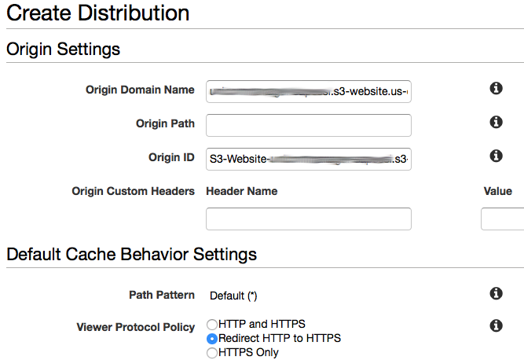

1. Click **Create Distribution** at the bottom of the page.

1. Creating a global distribution can take some time. Let CloudFront do its work in the background and move on the next step. We will come back to get the distribution endpoint at a later step.

</p></details>

### 6. Declare a new client application

#### Background
Amazon Cognito User Pools allows you to declare multiple client applications that can interact with your pool. This includes both applications you own and apps by third party developers. Each application is identified by an application id and client secret. Cognito User Pools also offers a hosted login UI that supports the most common user operations such as registration, login, reset passwords, and MFA. You can also customize the look and feel of the hosted UI.

#### High-Level Instructions
Using the Cognito console, add a new client application called **UnicornManager**. Because the client application is a static website hosted on S3 and written in JavaScript, we do not need a client secret. Next, also in the Cognito console, configure a domain name prefix for your hosted login UI. We called this **WildRydes-&lt;username&gt;**

<details>
<summary><strong>Step-by-step instructions (expand for details)</strong></summary><p>

1. In the AWS Management Console choose **Services** then select **Cognito** under Mobile.

1. In the intro page, click **Manage your User Pools** an open the **WildRydes** pool.

1. Open the **App clients** from the **General settings** menu on the left.

1. Click **Add another app client**.

1. Enter **Unicorn Manager** as the **App client name** and uncheck the **Generate client secret** checkbox.

    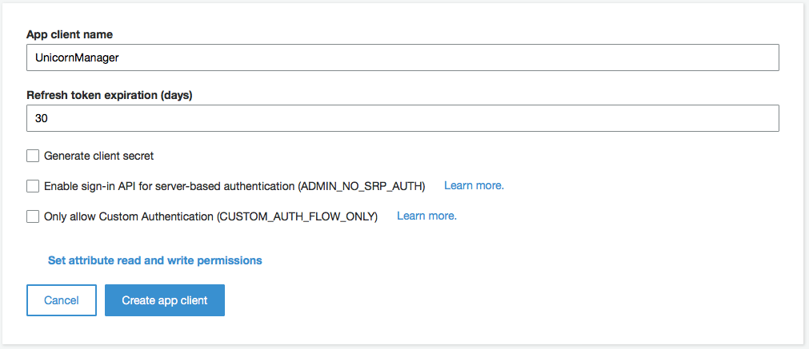

1. Click **Create app client**.

1. Open the **Domain name** configuration page.

1. Specify a unique custom domain name, for example **WildRydes-sapessi**.

1. Make sure that the domain name is available and then click **Save changes**.
</p></details>

### 7. Create the Unicorns scope in the Cognito User Pool

#### Background
Amazon Cognito User Pools lets you declare custom resource servers. Custom resource servers have a unique identifier - normally the server uri - and can declare custom scopes. You can allow custom applictions to request scopes in your user pools. When users authenticate with these applications, the Cognito hosted UI takes care of authenticating the user and authorizing the action. Custom claims are automatically added to the JWT access token.

#### High-Level Instructions
Using the Cognito console, open the **WildRydes** User Pool and create a new custom resource server called **UnicornServer**. The **UnicornServer** should use **UnicornManager** as the **Identifier** and allow the **unicorn** scope.

<details>
<summary><strong>Step-by-step instructions (expand for details)</strong></summary><p>

1. Open the **Services** menu and select **Cognito** in the Mobile section.

1. In the main screen, select **Manage your User Pools**.

1. Open the **WildRydes** pool and select **Resource Servers** under **App integration**.

    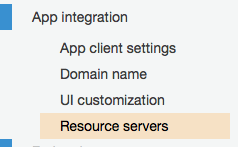

1. In the resource servers screen, click **Add a resource server**.

1. Specify **UnicornServer** as the **Name**.

1. For the **Identifier** use the URL from your S3 website in module 1. You can find this URL in the S3 console: Open the Wild Rydes website bucket, select the **Properties** tab, and click on the **Static Website Hosting** card. You can find the public endpoint at the top of the card.

1. In the **Scopes** section, declare a new scope called **unicorn**. I've used **Unicorn-specific access** as the description.

    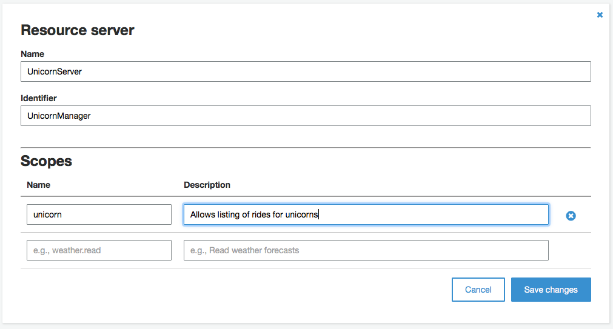

1. Click **Save changes** to create your new custom resource server.
</p></details>

### 8. Configure the new app client for OAuth

#### Background
Amazon Cognito User Pools supports the authorization code grant, implicit, and client credentials grants. Third party developers can load the Cognito hosted UI with their application ID and request any of the enabled flows. Cognito User Pools also exposes a set of client and server/admin APIs that you can use to build custom authentication flows. As a result of a successful authentication Cognito produces and OpenID Connect-compatible identity token and a JWT access token. The access token includes the custom scopes you declared for the application.

In our example, we will use the implicit flow for the sake of simplicity. Implicit grant flows are mostly used by mobile applications. Normally, you would require third party developers to host their own backend service and use the authorization code grant flow.

#### High-Level Instructions
Open the **App client settings** and configure the **UnicornManager** app to use **Cognito User Pool** as an identity provider and allow the **Implicit grant** flow. Make sure the application has access to the **custom scope** we created in step #7. As a callback URL, use the CloudFront distribution endpoint we created in step #5. The callback url will look like this: `https://xxxxxxxxxxx.cloudfront.net`.

<details>
<summary><strong>Step-by-step instructions (expand for details)</strong></summary><p>

1. In the AWS Management Console choose **Services** then select **Cognito** under Mobile.

1. In the intro page, click **Manage your User Pools** an open the **WildRydes** pool.

1. Open the **App clients settings** from the **App integration** menu on the left.

1. Enable the **Implicit grant** OAuth flow and allow the **http://wildrydes** custom scope.

1. In the **Callback** and **Signout** URLs, specify the HTTPS cloudfront distribution endpoint and add **/callback.html** at the end:
 1. You can find the distribution endpoint in the **CloudFront** console.
 1. Select the distribution we created in step #5.
 1. In the **General** tab, copy the value for **Domain name**.

    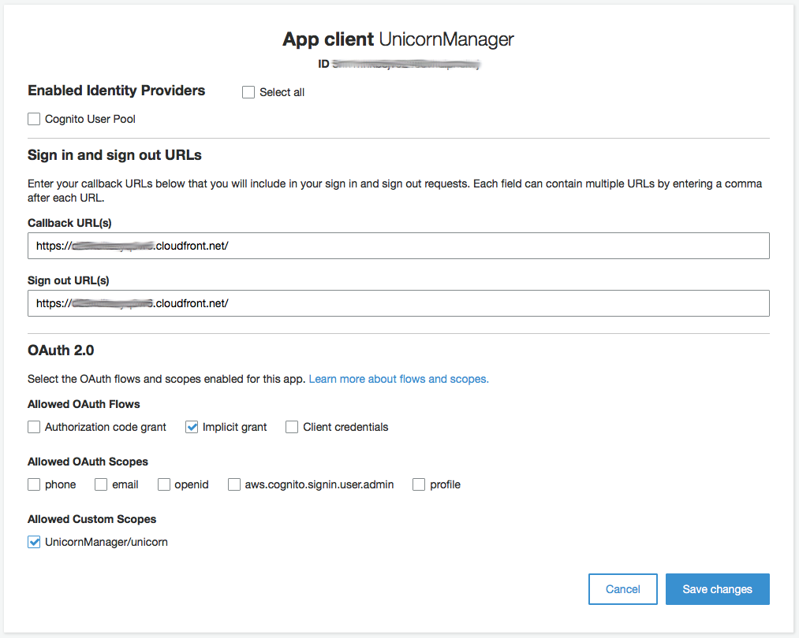

1. Click **Save changes**.

</p></details>

### 9. Configure and upload the Unicorn Manager application to S3

#### Background
The last step is to configure the client code with the new Cognito application id and upload to our S3 bucket. 

#### High-Level Instructions
Open the `config.js` file in the **UnicornManager** folder, replace the `userPoolClientId` with the new UnicornManager application id from Cognito, set the region and the domain prefix we configured in step #6. Finally, copy the **WildRydesApiInvokeUrl** value from the prerequisites CloudFormation stack output into the **invokeUrl** property of the config file. Save and close the file.

Upload the content of the **UnicornManager** folder to the root of your S3 bucket. You can use the AWS Management Console (requires Google Chrome browser) or the AWS CLI to complete this step. If you already have the AWS CLI installed and configured on your local machine, we recommend using that method. Otherwise, use the console if you have the latest version of Google Chrome installed.

<details>
<summary><strong>CLI step-by-step instructions (expand for details)</strong></summary><p>
##### AWS CLI

1. Open a terminal window and navigate to the folder where the material for this workshop is located. Navigate to the `WebApplication/5_OAuth/UnicornManager` folder.

1. Run the following command:

    ```
    aws s3 sync . s3://YOUR_BUCKET_NAME --region YOUR_BUCKET_REGION
    ```
##### AWS Console

1. Open the **S3** console and select the Unicorn Manager bucket.

1. In the **Overview** tab, click the **Upload** button.

1. From a file browser window, select all of the files in the **UnicornManager** folder and drag them to S3's upload window.
</p></details>

### Testing the application
Before we open the web page for the new Unicorn Manager application, we need to create a user for our unicorn. Using the **DynamoDB** console, open the **Tables** page and select the **Rides** table. In the **Items** tab, refresh the list of rides. Take the most common unicorn name from the **UnicornName** field and copy the value. 

Next, open the Wild Rydes web UI - you can find the link in the **Outputs** of the prerequisites CloudFormation stack. If the application logs you in automatically, log out first. Open the **register.html** page and create a new user. The registration automatically sends you a verification code to the email address you specified, activate the user by entering the verification code in the **verify.html** page.

With a web browser, navigate to the CloudFront endpoint for your Unicorn Manager web application. You can find the endpoint in the CloudFront console by opening the distribution - the field is called **Domain Name**. The website should redirect you automatically to the Cognito hosted login page. At the bottom of the login panel, click on the **Need an account? Sign Up** link. Use the unicorn name copied from DynamoDB as the username and a valid password, finally click **Sign Up**. Use the Cognito console to **Confirm** the user.

Open the CloudFront domain again and log in with the new user you just confirmed. Use the **Refresh** button to load the rides for the unicorn. 

