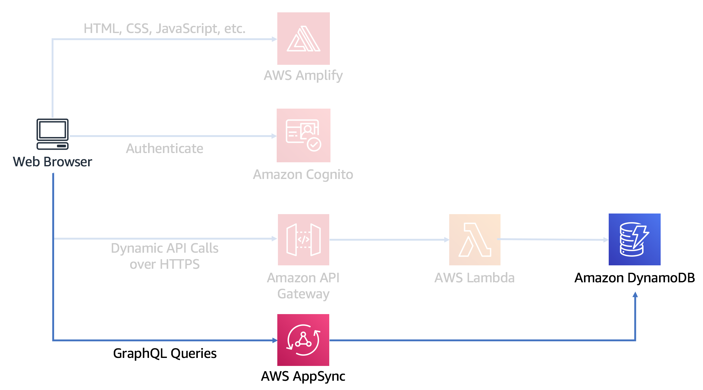
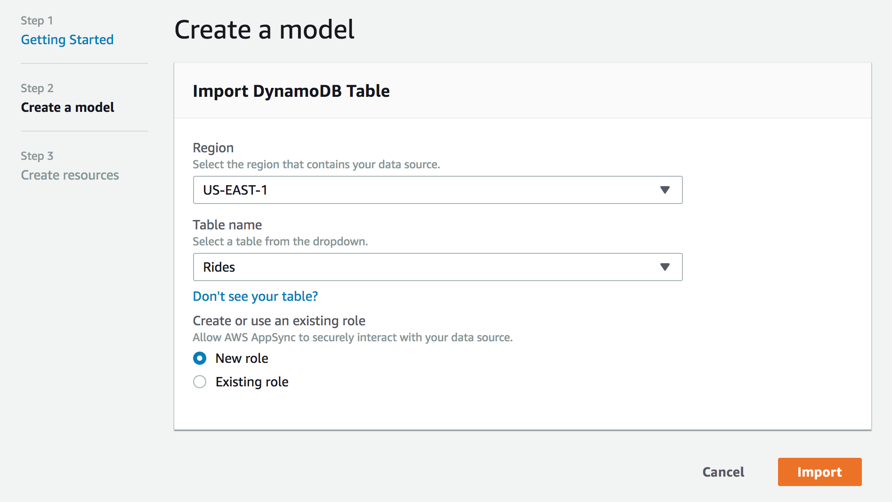
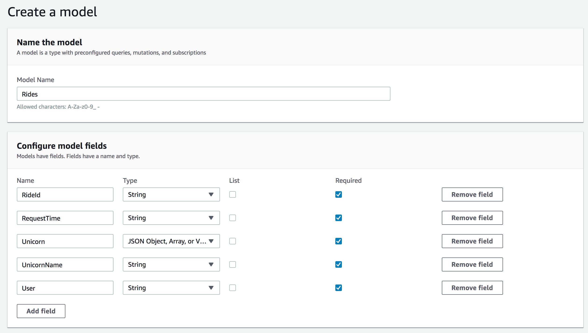
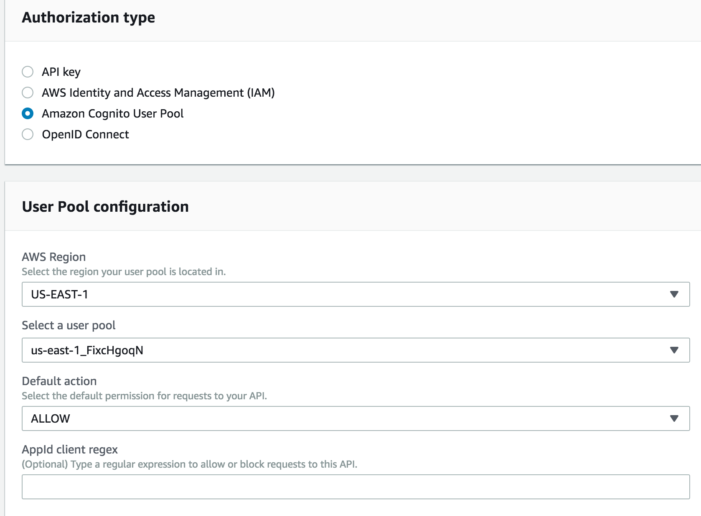
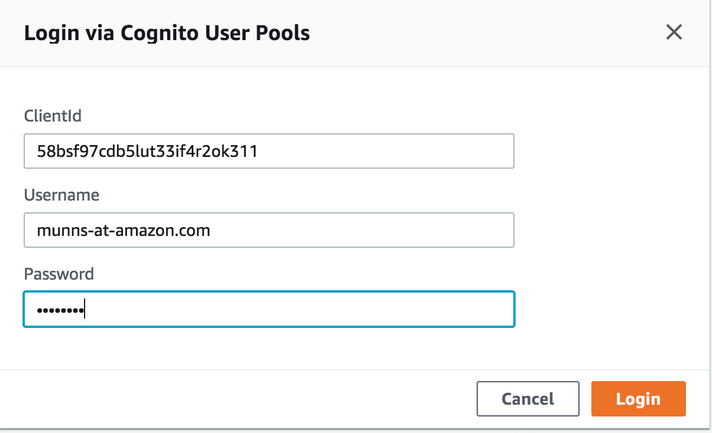

# Module 6: Serverless GraphQL API

*Note! This section is currently part of expansion of this lab. There is currently no Step 7*

In this module you'll use [AWS AppSync][appsync] to build a GraphQL API to find more information about the rides you have taken so far. In a subsequent module you will then modify our web application to add the ride history page which will query this API.

## Architecture Overview

In the [Serverless Backend][serverless-backend] module you created a Lambda function that stored data in a DynamoDB bucket. Then in the [RESTful APIs][restful-apis] module you put Amazon API Gatewway infront of the Lambda function so you could connect it to your web application. Every time that you request a ride through that API, the Lambda function stores the data. Now, let's get that data out and present it as ride history. 

GraphQL provides a robust query language API that works well with web and mobile based applications. AWS AppSync has the ability to put a GraphQL API infront of many different backends, including: AWS DynamoDB, AWS ElasticSearch Service, Amazon RDS Aurora, and AWS Lambda functions. The GraphQL API you will build here will allow you to return all rides, information about rides by their ID, and information about the unicorns that served your ride.



## Implementation Instructions

:heavy_exclamation_mark: Ensure you've completed the [RESTful APIs][restful-apis] step before beginning this module.

Each of the following sections provides an implementation overview and detailed, step-by-step instructions. The overview should provide enough context for you to complete the implementation if you're already familiar with the AWS Management Console or you want to explore the services yourself without following a walkthrough.

### 1. Create an AppSync GraphQL API

#### High-Level Instructions

Use the AWS AppSync console to create a new GraphQL API. Call your API `RidesHistory`. Import the DynamoDB database created in the [Serverless Backend][serverless-backend] module and then create an additional query for getting all rides by a certain unicorn.

**:white_check_mark: Step-by-step directions**
1. Go to the [AWS AppSync Console][appsync-console].
1. Choose **Create API**.
1. Select *Import DynamoDB table* and click **Start**.
1. Select the *Region* of your table and enter its *Table name*. Leave *New Role* selected. Click **Import**.

    

1. AppSync will only detect the Primary Key which was set for your DynamoDB table, but you'll want to map the rest of the data saved by the Lambda function for each ride. You can find what the fields are by looking at an item from your table:
    1. Go to the [Amazon DymamoDB console][dynamodb-console] in a new browser tab or window.
    1. From the left navigation, select **Tables**.
    1. Select the table you created earlier (it should be `Rides`).
    1. Select the **Items** tab and then select a ride by its `RideId`.
    1. In the pop up window that opens, select **Text** and check `DynamoDB JSON`.
    1. Record the JSON created here into a scratchpad so that you can refer to it later. The JSON contains the attribute name, type, and data.
    1. Select **Cancel** to close the popup without modifying the item.

1. Back in the AppSync console, configure the data model by adding fields that represent all off the top level item attributes recorded from DynamoDB. The items with type `S` are `Strings`, `M` are `JSON Object, Array, or Value`. Check the box for `Required` for all records.

    

1. Click **Create**.
1. Name the API `RidesHistory` and click `Create`.

### 2. Create query to find rides by UnicornName

#### Background

AWS AppSync has created a base GraphQL schema that contains basic functionality for our API. We could use it to create and delete items from out database, but we're only interested in retrieving data in this module. Expand on what was created by adding a query to find rides based on the unicorn that serviced them. The DynamoDB table currently has no indexes on any other attributes and so you will need to create a SCAN request filtered by UnicornName.

#### High-Level Instructions

Create a new query `getRidesByUnicornName` that retrieves the ride information based on the `UnicornName`.

**:white_check_mark: Step-by-step directions**
1. While in the [AWS AppSync Console][appsync-console] in your `RidesHistory` API, select **Schema**.
1. In the Schema editor modify the Query object to add a new query:
    `getRidesByUnicornName(UnicornName: String, limit: Int, nextToken: String): RidesConnection`
    
    Such that the final object contains 3 queries:
    ```
    type Query {
    	getRides(RideId: String!): Rides
    	getRidesByUnicornName(UnicornName: String, limit: Int, nextToken: String): RidesConnection
    	listRides(filter: TableRidesFilterInput, limit: Int, nextToken: String): RidesConnection
    }
    ```

1. Click **Save Schema**>
1. Under *Resolvers* find the *Query* section and select **Attach** next to the new query you just created.

    

1. On the *Create new Resolver* page, select the the `Rides` Data source.
1. In the *Configure the request mapping template.* panel, from the drop down select **Simple Query with Pagination**
1. In the JSON created, replace the `operation` with `Scan` and the `query` with `filter` for the object that contains expression attributes.
1. In the `filter` object, replace every instance of `id` with `UnicornName`.
    1. The final JSON for the request mapping template should look like this:
    ```
    {
        "version" : "2017-02-28",
        "operation" : "Scan",
        "filter" : {
            ## Provide a query expression. **
            "expression": "UnicornName = :UnicornName",
            "expressionValues" : {
                ":UnicornName" : {
                    "S" : "${ctx.args.UnicornName}"
                }
            }
        },
        ## Add 'limit' and 'nextToken' arguments to this field in your schema to implement pagination. **
        "limit": $util.defaultIfNull(${ctx.args.limit}, 20),
        "nextToken": $util.toJson($util.defaultIfNullOrBlank($ctx.args.nextToken, null))
    }
    ```

1. In the *Configure the response mapping template.* panel, from the drop down select **Return paginated results**.
    1. The final JSON for the response mapping template should look like this:
    ```
    {
        "items": $util.toJson($ctx.result.items),
        "nextToken": $util.toJson($util.defaultIfNullOrBlank($context.result.nextToken, null))
    }
    ```
1. At the top of the page select **Save Resolver**.

### 3. Configure authorization

AWS AppSync supports using [Amazon Cognito][cognito] user pools to support user authorization of requests. Configure your GraphQL API to use the user pool that you created in the [User Management][user-management] module earlier.

#### High-Level Instructions

Configure the AppSync GraphQL API to use the `WildRydes` user pool as an authorizer.

**:white_check_mark: Step-by-step directions**
1. While in the [AWS AppSync Console][appsync-console] in your `RidesHistory` API, select **Settings**.
1. Under *Authorization type* select *Amazon Cognito User Pool*.
1. Under *User Pool configuration* select the region of your user pool and then select the user pool created earlier. Lastly, select *ALLOW* as the default action.
1. At the bottom of the page, select **Save**.

    

## Implementation Validation

The [AWS AppSync Console][appsync-console] contains a helpful query tool that allows you to test out the queries you've created, even allowing you to authenticate with Amazon Cognito from it.

**:white_check_mark: Step-by-step directions**
1. While in the [AWS AppSync Console][appsync-console] in your `RidesHistory` API, select **Queries**.
1. Select *Login with User Pools**
1. In the *Login with Cognito User Pools* popup, for `ClientId` enter the `appid` saved earlier. The `appid` can also be found in the Amazon Cognito User Pool and click "App clients" under General settings on the left column.
1. Now you need to login with the user you created earlier in the [User Management][user-management] module. One thing to note is that in Cognito your username is different than your email. You'll need to head to the Cognito Console to find the user name for your created user:
    1. Go to the [Amazon Cognito Console][cognito-console]
    1. Select **Manage User Pools**
    1. Select the user pool created earlier **WildRydes**
    1. From the left navigation, select **Users and groups**
    1. Make note of the username shown
1. Login with your username and password as set earlier.

    

    You should now be able to execute the queries listed. First, remove the `Mutation` so you don't accidentally create records using the GraphQL interface.
1. Remove the JSON object for the `mutation createRides`.
1. Click on the **Play** arrow button in the top of the page. This will execute the `query listRides` query returning all of the data from the DynamoDB table:
    ```
    {
      "data": {
        "listRides": {
          "items": [
            {
              "RideId": "MeQtpZtYg4GxKpXK6-FwEA",
              "RequestTime": "2019-05-01T16:39:46.909Z",
              "Unicorn": "{\"Color\":\"White\",\"Gender\":\"Male\",\"Name\":\"Shadowfax\"}",
              "UnicornName": "Shadowfax",
              "User": "munns-at-amazon.com"
            },
            {
              "RideId": "rKVp3qNg5w056Ei3k_xQTg",
              ...
    ```
    Make a note of the `RideId` for one of the rides displayed.
1. In the query editor, create a additional query for the defined `getRides` query in your schema. The `getRides` query takes a single filter argument `RideId`. You can return whatever attributes you would like:
    ```
    query getRides {
      getRides(RideId: "MeQtpZtYg4GxKpXK6-FwEA"){
        RideId
        UnicornName
      }
    }
    ```

1. Click on the **Play** arrow button in the top of the page and select `getRides` from the new drop down that pops up. On the right you should see the results of the query:
    ```
    {
      "data": {
        "getRides": {
          "RideId": "MeQtpZtYg4GxKpXK6-FwEA",
          "UnicornName": "Shadowfax"
        }
      }
    }
    ```

1. In the query editor, create a additional query for the defined `getRidesByUnicornName` query in created previously in the schema. The `getRidesByUnicornName` query also takes a single argument of `UnicornName` and returns a type of `items` that can contain whatever attributes you would like to return. Set the UnicornName to a name seen in the output of either of the two previous queries:
    ```
    query getRidesByUnicornName {
      getRidesByUnicornName(UnicornName: "Shadowfax"){
        items {
          RideId
          Unicorn
          UnicornName
          RequestTime
        }
      }
    }
    ```

1. Execute this query from the **Play** drop down and you should now see all rides that were performed by the named unicorn provided. If you only have a single ride by this unicorn explore testing the query using a differnt UnicornName. Note that if you have very few saved rides, you might need to go into the `/rides.html` interface on the web application and generate more rides.
    ```
    {
      "data": {
        "getRidesByUnicornName": {
          "items": [
            {
              "RideId": "MeQtpZtYg4GxKpXK6-FwEA",
              "Unicorn": "{\"Color\":\"White\",\"Gender\":\"Male\",\"Name\":\"Shadowfax\"}",
              "UnicornName": "Shadowfax",
              "RequestTime": "2019-05-01T16:39:46.909Z"
            },
            {
              "RideId": "c4gr5VI0UfqUKCg6XgHFzQ",
              "Unicorn": "{\"Color\":\"White\",\"Gender\":\"Male\",\"Name\":\"Shadowfax\"}",
              "UnicornName": "Shadowfax",
              "RequestTime": "2019-05-01T18:51:14.597Z"
            },
            ...
    ```

You've completed the testing of your AWS AppSync based GraphQL API!

### :star: Recap

:key: [AWS AppSync][appsync] simplifies application development by letting you create a flexible API to securely access, manipulate, and combine data from one or more data sources. AppSync is a managed service that uses GraphQL to make it easy for applications to get exactly the data they need.

:wrench: In this module you've created an AppSync API and connected it to our DynamoDB database created in an earlier module. You then set the authorization mechanism to the same that we are using for our REST API and web application meaning you'll have a unified way across these 3 different aspects of the application.

### Next

:white_check_mark: After you have successfully tested your new function using the Lambda console, you can move on to the next module, [Building the History page][history-page].

[amplify-console-console]: https://console.aws.amazon.com/amplify/home
[amplify-console]: https://aws.amazon.com/amplify/console/
[api-gw]: https://aws.amazon.com/api-gateway/
[appsync-console]: https://console.aws.amazon.com/appsync/home
[appsync]: https://aws.amazon.com/appsync/
[cognito]: https://aws.amazon.com/cognito/
[dynamodb-console]: https://console.aws.amazon.com/dynamodb/home
[dynamodb]: https://aws.amazon.com/dynamodb/
[history-page]: ../7_RideHistoryPage/
[iam-console]: https://console.aws.amazon.com/iam/home
[lambda-console]: https://console.aws.amazon.com/lambda/home
[lambda]: https://aws.amazon.com/lambda/
[restful-apis]: ../4_RESTfulAPIs/
[static-web-hosting]: ../1_StaticWebHosting/
[user-management]: ../2_UserManagement/
