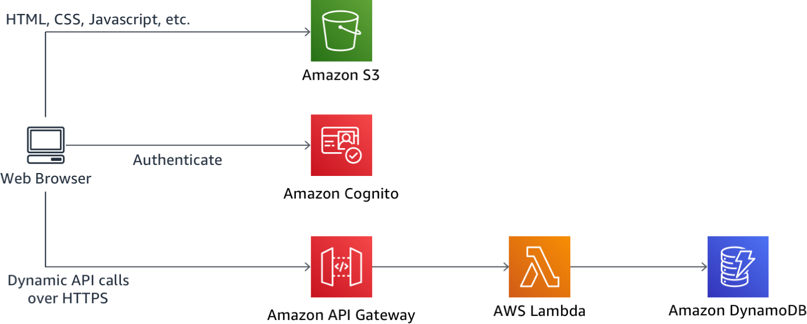

# Serverless Web Application Workshop

In this workshop you'll deploy a simple web application that enables users to request unicorn rides from the [Wild Rydes](http://www.wildrydes.com/) fleet. The application will present users with an HTML based user interface for indicating the location where they would like to be picked up and will interface on the backend with a RESTful web service to submit the request and dispatch a nearby unicorn. The application will also provide facilities for users to register with the service and log in before requesting rides.

The application architecture uses [AWS Lambda](https://aws.amazon.com/lambda/), [Amazon API Gateway](https://aws.amazon.com/api-gateway/), [Amazon S3](https://aws.amazon.com/s3/), [Amazon DynamoDB](https://aws.amazon.com/dynamodb/), and [Amazon Cognito](https://aws.amazon.com/cognito/). S3 hosts static web resources including HTML, CSS, JavaScript, and image files which are loaded in the user's browser. JavaScript executed in the browser sends and receives data from a public backend API built using Lambda and API Gateway. Amazon Cognito provides user management and authentication functions to secure the backend API. Finally, DynamoDB provides a  persistence layer where data can be stored by the API's Lambda function.

See the diagram below for a depiction of the complete architecture.

If you'd like to jump in and get started please visit the [Static Web hosting](1_StaticWebHosting) module page to begin the workshop.

## Prerequisites

### AWS Account

In order to complete this workshop you'll need an AWS Account with access to create AWS IAM, S3, DynamoDB, Lambda, API Gateway and Cognito resources. The code and instructions in this workshop assume only one student is using a given AWS account at a time. If you try sharing an account with another student, you'll run into naming conflicts for certain resources. You can work around these by appending a unique suffix to the resources that fail to create due to conflicts, but the instructions do not provide details on the changes required to make this work.

All of the resources you will launch as part of this workshop are eligible for the AWS free tier if your account is less than 12 months old. See the [AWS Free Tier page](https://aws.amazon.com/free/) for more details.

### Browser

We recommend you use the latest version of Chrome to complete this workshop.

### Text Editor

You will need a local text editor for making minor updates to configuration files.

## Modules

This workshop is broken up into multiple modules. You must complete each module before proceeding to the next, however, modules 1 and 2 have AWS CloudFormation templates available that you can use to launch the necessary resources without manually creating them yourself if you'd like to skip ahead.

1. [Static Web hosting](1_StaticWebHosting)
2. [User Management](2_UserManagement)
3. [Serverless Backend](3_ServerlessBackend)
4. [RESTful APIs](4_RESTfulAPIs)

After you have completed the workshop you can delete all of the resources that were created by following the [cleanup guide](9_CleanUp).
